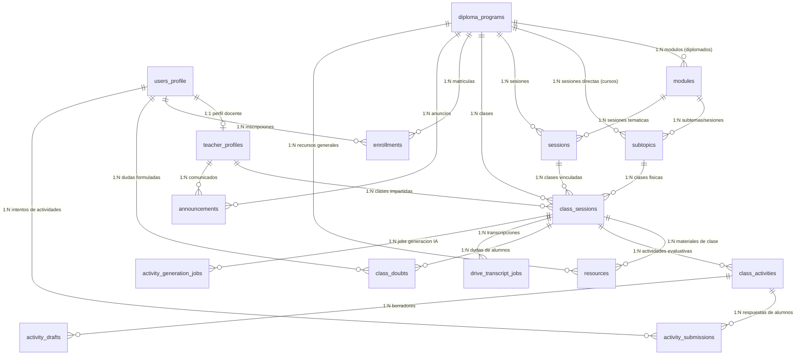

# 🗄️ Modelo de Datos y Esquema de Base de Datos — LIATER
### Universidad Nacional de Colombia & Corenius

Este documento detalla la estructura física y lógica de la base de datos de **LIATER** alojada en **Supabase (PostgreSQL 15+)**, cubriendo la totalidad de entidades, llaves primarias, foráneas, restricciones de integridad, índices y políticas de **Row Level Security (RLS)**.

---

## 1. 📊 Diagrama Entidad-Relación (ERD)

---

## 2. 🏛️ Jerarquía Académica

La base de datos soporta dos modalidades académicas mediante el campo `program_type` en `diploma_programs`:

1. **Diplomados (`program_type = 'diplomado'`):**
   $$\text{DiplomaProgram} \xrightarrow{1:N} \text{Module} \xrightarrow{1:N} \text{Session / Subtopic} \xrightarrow{1:N} \text{ClassSession} \xrightarrow{1:N} \text{Resource / Activity}$$
   - Gran escala, duración prolongada (80+ horas).
   - Estructuración por Módulos temáticos.

2. **Cursos Cortos / Talleres (`program_type = 'curso' | 'taller'`):**
   $$\text{DiplomaProgram} \xrightarrow{1:N} \text{Session / Subtopic} \xrightarrow{1:N} \text{ClassSession} \xrightarrow{1:N} \text{Resource / Activity}$$
   - Sesiones directas sin necesidad de encapsular en módulos.
   - En la interfaz, la navegación de módulos se omite automáticamente.

---

## 3. 📋 Detalle de Tablas y Atributos

### 3.1 Gestión de Usuarios e Identidad

#### `users_profile`
Tabla central vinculada a la tabla interna `auth.users` de Supabase mediante disparador (*trigger*) o creación explícita.
| Columna | Tipo | Restricción | Descripción |
| :--- | :--- | :--- | :--- |
| `id` | `uuid` | `PRIMARY KEY` | Referencia 1:1 a `auth.users(id)` |
| `full_name` | `varchar` | `NOT NULL` | Nombre completo del usuario |
| `email` | `varchar` | `NOT NULL, UNIQUE` | Correo electrónico institucional o personal |
| `role` | `varchar` | `CHECK (role IN ('student', 'teacher', 'admin'))` | Rol en el sistema |
| `is_active` | `boolean` | `DEFAULT true` | Estado de habilitación en el portal |
| `created_at` | `timestamptz` | `DEFAULT now()` | Fecha de registro |

#### `teacher_profiles`
Información pública y profesional de los profesores para visualización de los estudiantes.
| Columna | Tipo | Restricción | Descripción |
| :--- | :--- | :--- | :--- |
| `id` | `uuid` | `PRIMARY KEY` | Identificador único del perfil docente |
| `user_id` | `uuid` | `FK -> users_profile(id), ON DELETE CASCADE` | Usuario asociado |
| `name` | `varchar` | `NOT NULL` | Nombre profesional para el aula |
| `bio` | `text` | `NULLABLE` | Resumen de trayectoria profesional y académica |
| `area` | `varchar` | `NULLABLE` | Especialidad o cátedra que imparte |
| `photo_url` | `text` | `NULLABLE` | URL de la fotografía de perfil |
| `linkedin_url` | `text` | `NULLABLE` | Enlace al perfil de LinkedIn |
| `created_at` | `timestamptz` | `DEFAULT now()` | Fecha de creación |

---

### 3.2 Estructura Académica

#### `diploma_programs`
Contenedor principal de un programa formativo (diplomado, curso o taller).
| Columna | Tipo | Restricción | Descripción |
| :--- | :--- | :--- | :--- |
| `id` | `uuid` | `PRIMARY KEY` | Identificador del programa |
| `title` | `varchar` | `NOT NULL` | Título del diplomado o curso |
| `description` | `text` | `NULLABLE` | Sinopsis y objetivos del programa |
| `program_type` | `varchar` | `DEFAULT 'diplomado'` | `'diplomado'`, `'curso'`, `'taller'` |
| `thumbnail_url` | `text` | `NULLABLE` | Imagen de portada para el catálogo del portal |
| `drive_folder_id` | `text` | `NULLABLE` | ID o enlace de la carpeta de Google Drive del curso |
| `meet_url` | `text` | `NULLABLE` | Enlace permanente a la sala virtual (Meet/Zoom) |
| `is_published` | `boolean` | `DEFAULT false` | Visibilidad pública en el portal |
| `created_at` | `timestamptz` | `DEFAULT now()` | Fecha de creación |

#### `modules`
Módulos temáticos superiores (utilizados principalmente en diplomados).
| Columna | Tipo | Restricción | Descripción |
| :--- | :--- | :--- | :--- |
| `id` | `uuid` | `PRIMARY KEY` | Identificador del módulo |
| `program_id` | `uuid` | `FK -> diploma_programs(id), ON DELETE CASCADE` | Programa al que pertenece |
| `title` | `varchar` | `NOT NULL` | Título del módulo |
| `description` | `text` | `NULLABLE` | Resumen del contenido curricular |
| `order_index` | `integer` | `DEFAULT 0` | Secuencia de presentación (1, 2, 3...) |
| `created_at` | `timestamptz` | `DEFAULT now()` | Fecha de creación |

#### `subtopics` / `sessions`
Unidad temática intermedia que agrupa una o más clases físicas.
| Columna | Tipo | Restricción | Descripción |
| :--- | :--- | :--- | :--- |
| `id` | `uuid` | `PRIMARY KEY` | Identificador de la sesión / subtema |
| `module_id` | `uuid` | `FK -> modules(id), ON DELETE CASCADE, NULLABLE` | Módulo padre (en diplomados) |
| `program_id` | `uuid` | `FK -> diploma_programs(id), NULLABLE` | Programa directo (en cursos cortos) |
| `title` | `varchar` | `NOT NULL` | Título de la sesión (ej: *Sesión 1: Introducción*) |
| `description` | `text` | `NULLABLE` | Descripción de las temáticas |
| `order_index` | `integer` | `DEFAULT 0` | Orden dentro del módulo o curso |
| `created_at` | `timestamptz` | `DEFAULT now()` | Fecha de creación |

#### `class_sessions`
Clase individual (sincrónica en vivo o asincrónica grabada).
| Columna | Tipo | Restricción | Descripción |
| :--- | :--- | :--- | :--- |
| `id` | `uuid` | `PRIMARY KEY` | Identificador de la clase |
| `subtopic_id` | `uuid` | `FK -> subtopics(id), ON DELETE CASCADE` | Sesión a la que pertenece |
| `program_id` | `uuid` | `FK -> diploma_programs(id)` | Programa académico asociado |
| `teacher_id` | `uuid` | `FK -> teacher_profiles(id), NULLABLE` | Profesor asignado a impartir la clase |
| `title` | `varchar` | `NOT NULL` | Título o nombre de la clase (ej: *Clase 1*) |
| `description` | `text` | `NULLABLE` | Resumen de los puntos tratados |
| `class_date` | `timestamptz` | `NULLABLE` | Fecha y hora programada |
| `duration` | `integer` | `NULLABLE` | Duración en minutos |
| `video_url` | `text` | `NULLABLE` | Enlace a la grabación en YouTube |
| `presentation_url`| `text` | `NULLABLE` | Enlace a la presentación (Google Drive `/preview`) |
| `drive_folder_id` | `text` | `NULLABLE` | ID de carpeta de Drive específica de la clase |
| `meet_url` | `text` | `NULLABLE` | Enlace a la sala en vivo de esta clase |
| `order_index` | `integer` | `DEFAULT 0` | Orden de la clase dentro de la sesión |
| `created_at` | `timestamptz` | `DEFAULT now()` | Fecha de creación |

---

### 3.3 Recursos, Matrículas y Comunicación

#### `resources`
Materiales de apoyo (presentaciones, lecturas, PDFs, enlaces, repositorios).
| Columna | Tipo | Restricción | Descripción |
| :--- | :--- | :--- | :--- |
| `id` | `uuid` | `PRIMARY KEY` | Identificador del recurso |
| `class_id` | `uuid` | `FK -> class_sessions(id), ON DELETE CASCADE, NULLABLE` | Clase asociada (null para recursos generales) |
| `program_id` | `uuid` | `FK -> diploma_programs(id), NULLABLE` | Programa asociado (para recursos generales) |
| `title` | `varchar` | `NOT NULL` | Título descriptivo del material |
| `description` | `text` | `NULLABLE` | Descripción complementaria |
| `resource_type` | `varchar` | `CHECK (resource_type IN ('presentation', 'pdf', 'link', 'video', 'file', 'code'))` | Tipo de recurso |
| `url` | `text` | `NOT NULL` | Enlace de acceso (Drive `/preview`, web, etc.) |
| `is_visible` | `boolean` | `DEFAULT true` | Visibilidad ante los estudiantes |
| `is_downloadable`| `boolean` | `DEFAULT true` | Control de descargabilidad por los alumnos |
| `created_at` | `timestamptz` | `DEFAULT now()` | Fecha de subida |

#### `enrollments`
Control de acceso y matrícula de estudiantes en programas académicos.
| Columna | Tipo | Restricción | Descripción |
| :--- | :--- | :--- | :--- |
| `id` | `uuid` | `PRIMARY KEY` | Identificador de la matrícula |
| `student_id` | `uuid` | `FK -> users_profile(id), ON DELETE CASCADE` | Estudiante matriculado |
| `program_id` | `uuid` | `FK -> diploma_programs(id), ON DELETE CASCADE` | Programa en el que está matriculado |
| `enrolled_at` | `timestamptz` | `DEFAULT now()` | Fecha de matriculación |
| `status` | `varchar` | `DEFAULT 'active'` | Estado (`active`, `completed`, `suspended`) |

#### `announcements`
Avisos y comunicados oficiales emitidos por profesores o administradores.
| Columna | Tipo | Restricción | Descripción |
| :--- | :--- | :--- | :--- |
| `id` | `uuid` | `PRIMARY KEY` | Identificador del aviso |
| `program_id` | `uuid` | `FK -> diploma_programs(id), ON DELETE CASCADE` | Programa al que aplica |
| `teacher_id` | `uuid` | `FK -> teacher_profiles(id), NULLABLE` | Docente emisor (null si es el admin) |
| `title` | `varchar` | `NOT NULL` | Título del comunicado |
| `message` | `text` | `NOT NULL` | Contenido del anuncio |
| `target_role` | `varchar` | `DEFAULT 'all'` | Rol objetivo (`all`, `student`, `teacher`) |
| `created_at` | `timestamptz` | `DEFAULT now()` | Fecha de publicación |

---

### 3.4 Evaluaciones, Dudas e Inteligencia Artificial

#### `class_activities`
Cuestionarios y actividades formativas de clase generadas con IA o manualmente.
| Columna | Tipo | Restricción | Descripción |
| :--- | :--- | :--- | :--- |
| `id` | `uuid` | `PRIMARY KEY` | Identificador de la actividad |
| `class_id` | `uuid` | `FK -> class_sessions(id), ON DELETE CASCADE` | Clase evaluada |
| `title` | `varchar` | `NOT NULL` | Nombre de la actividad formativa |
| `description` | `text` | `NULLABLE` | Instrucciones |
| `questions` | `jsonb` | `NOT NULL` | Arreglo JSON de preguntas, opciones y justificaciones |
| `due_date` | `timestamptz` | `NULLABLE` | Fecha y hora límite de entrega |
| `is_published` | `boolean` | `DEFAULT true` | Estado de publicación ante los alumnos |
| `created_at` | `timestamptz` | `DEFAULT now()` | Fecha de creación |

#### `activity_submissions`
Respuestas e intentos realizados por los estudiantes en las actividades formativas.
| Columna | Tipo | Restricción | Descripción |
| :--- | :--- | :--- | :--- |
| `id` | `uuid` | `PRIMARY KEY` | Identificador del intento |
| `activity_id` | `uuid` | `FK -> class_activities(id), ON DELETE CASCADE` | Actividad evaluada |
| `student_id` | `uuid` | `FK -> users_profile(id), ON DELETE CASCADE` | Estudiante que respondió |
| `answers` | `jsonb` | `NOT NULL` | Respuestas seleccionadas por el alumno |
| `score` | `numeric` | `NOT NULL` | Calificación obtenida (0.0 a 5.0) |
| `submitted_at`| `timestamptz` | `DEFAULT now()` | Fecha y hora de finalización del intento |

#### `class_doubts`
Foro de preguntas y respuestas vinculado al minuto del video de la clase.
| Columna | Tipo | Restricción | Descripción |
| :--- | :--- | :--- | :--- |
| `id` | `uuid` | `PRIMARY KEY` | Identificador de la duda |
| `class_id` | `uuid` | `FK -> class_sessions(id), ON DELETE CASCADE` | Clase sobre la que se pregunta |
| `user_id` | `uuid` | `FK -> users_profile(id), ON DELETE CASCADE` | Usuario que formula la pregunta |
| `question` | `text` | `NOT NULL` | Contenido de la duda |
| `timestamp_seconds`| `integer` | `NULLABLE` | Minuto/segundo del video de la clase |
| `answer` | `text` | `NULLABLE` | Respuesta emitida por el docente |
| `answered_by` | `uuid` | `FK -> users_profile(id), NULLABLE` | Docente que resolvió la duda |
| `created_at` | `timestamptz` | `DEFAULT now()` | Fecha de formulación |

#### `drive_transcript_jobs` & `activity_generation_jobs`
Tablas de control de colas y estado para la extracción de transcripciones y generación de preguntas con Gemini AI.
| Columna | Tipo | Restricción | Descripción |
| :--- | :--- | :--- | :--- |
| `id` | `uuid` | `PRIMARY KEY` | Identificador del job |
| `class_id` | `uuid` | `FK -> class_sessions(id)` | Clase asociada |
| `status` | `varchar` | `CHECK (status IN ('pending', 'processing', 'completed', 'failed'))` | Estado del procesamiento |
| `transcript_text` | `text` | `NULLABLE` | Texto extraído de la clase |
| `error_message` | `text` | `NULLABLE` | Detalle del error en caso de fallo |
| `created_at` | `timestamptz` | `DEFAULT now()` | Marca de tiempo |

---

## 4. 🔒 Seguridad y Row Level Security (RLS)

Todas las tablas cuentan con `ALTER TABLE ... ENABLE ROW LEVEL SECURITY;`. Las reglas cardinales son:
1. **Acceso de Administradores:** Usuarios con `role = 'admin'` en `users_profile` poseen acceso irrestricto de lectura y escritura (`FOR ALL`) sobre todas las tablas.
2. **Acceso de Docentes:** Profesores con `role = 'teacher'` pueden gestionar las clases que tienen asignadas a través de su `teacher_id` o crear recursos en cursos donde imparten clases.
3. **Acceso de Estudiantes:** Alumnos con `role = 'student'` únicamente pueden leer información de programas en los que figuren matriculados dentro de `enrollments`.
4. **Protección de Intentos:** Los estudiantes sólo pueden leer y crear sus propias entregas en `activity_submissions` (`student_id = auth.uid()`).
