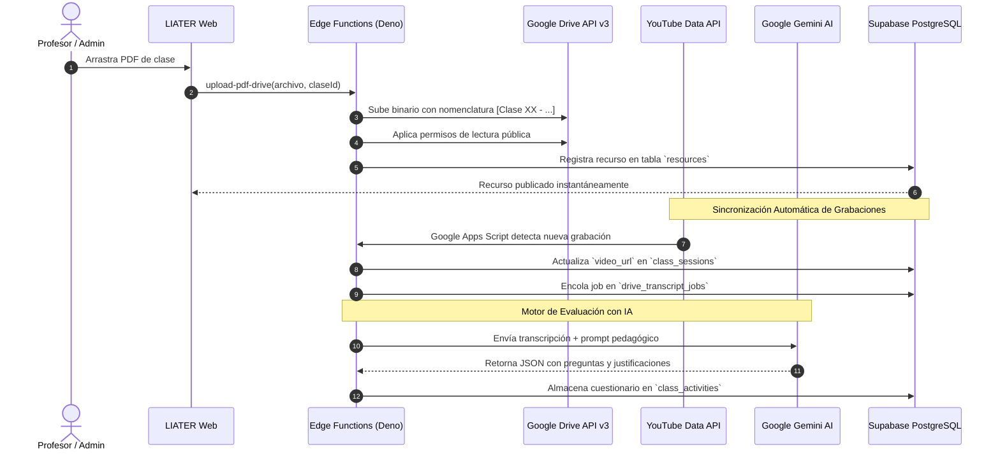

# 🎯 Alcance del Proyecto: Plataforma Web LIATER
### Sistema de Gestión del Aprendizaje (LMS) — UNAL & Corenius

## 1. 📌 Objetivo General del Proyecto

Desarrollar, desplegar y operar una plataforma de aprendizaje en línea (**LMS**) de alto rendimiento y diseño *premium*, destinada a la **Universidad Nacional de Colombia — Sede Bogotá** en alianza con **Corenius**. 

La plataforma centraliza la oferta académica de educación continua, permitiendo gestionar de manera unificada tanto **diplomados extensos** (estructurados en Módulos $\rightarrow$ Sesiones $\rightarrow$ Clases) como **cursos cortos y talleres especializados** (organizados directamente en Sesiones $\rightarrow$ Clases), con integraciones automatizadas hacia **Google Drive**, **YouTube** e **Inteligencia Artificial (Gemini)**.

---

## 2. 👥 Actores y Perfiles de Usuario

El sistema atiende a tres actores fundamentales, cada uno con experiencias de usuario y privilegios aislados:

```
                  ┌────────────────────────┐
                  │    USUARIOS LIATER     │
                  └───────────┬────────────┘
                              │
         ┌────────────────────┼────────────────────┐
         ▼                    ▼                    ▼
   [ ESTUDIANTE ]       [ PROFESOR ]       [ ADMINISTRADOR ]
   - Consume clases     - Imparte clases    - Gestiona todo el LMS
   - Estudia recursos   - Sube material     - Matricula estudiantes
   - Responde quices    - Crea anuncios     - Configura carpetas
   - Resuelve dudas     - Evalúa refuerzo   - Asigna profesores
```

### 2.1 Estudiante (`student`)
- **Autenticación e inicio:** Acceso protegido a sus cursos inscritos desde el catálogo del portal.
- **Navegación académica:** Visualización intuitiva de módulos, sesiones y clases según la naturaleza del programa.
- **Aula virtual interactiva:**
  - Reproductor de video de alta calidad de la clase grabada.
  - Visor embebido de presentaciones y lecturas sin necesidad de descargas forzosas ni autenticación externa.
  - Formulación de dudas académicas asociadas al minuto exacto del video.
  - Realización de actividades de refuerzo formativo (quices) con retroalimentación inmediata.
- **Centro de recursos:** Búsqueda y filtrado de lecturas, guías y presentaciones por tipo y por sesión, con descarga permitida según las políticas del docente.
- **Avisos y comunicados:** Recepción de notificaciones emitidas por docentes o administradores.

### 2.2 Docente / Profesor (`teacher`)
- **Panel docente dedicado:** Vista de sus asignaciones académicas organizadas por curso y sesión.
- **Gestión de clases asignadas:** Consulta y edición de enlaces virtuales (Meet/Zoom), fechas y grabaciones de clase.
- **Carga de presentaciones a Google Drive:**
  - Zona de arrastrar y soltar (*Drag & Drop*) que estandariza automáticamente la nomenclatura del archivo (`[Clase XX - Titulo] Nombre.pdf`).
  - Depósito directo en la carpeta institucional de Google Drive y publicación instantánea.
- **Centro de recursos del curso:** Subida de materiales adicionales tanto a clases específicas como a nivel general del curso.
- **Control de descargabilidad:** Opción para decidir si el material didáctico puede ser descargado por los estudiantes o sólo visualizado en pantalla.
- **Generación y control de actividades con IA:** Supervisión de las preguntas formativas generadas por Gemini a partir de las transcripciones de clase.
- **Comunicación:** Publicación de anuncios para los estudiantes de sus cursos.

### 2.3 Administrador (`admin`)
- **Control total de la infraestructura:** Acceso irrestricto a todos los diplomados, cursos, usuarios y recursos.
- **Portal de programas:** Creación, edición, publicación y archivado de programas académicos (`diplomado`, `curso`, `taller`).
- **Gestión global de usuarios (`/users`):**
  - Registro e invitación de nuevos estudiantes y docentes.
  - Matrícula y desvinculación masiva de estudiantes en programas mediante la tabla `enrollments`.
  - Activación y suspensión suave de cuentas.
- **Diseñador de cursos (*Course Builder*):**
  - Estructuración jerárquica de módulos, sesiones y clases.
  - Asignación de docentes a clases específicas.
  - Ordenamiento secuencial por arrastre o índice.
- **Configuración institucional de Google Drive:** Vinculación de la carpeta raíz de Drive de cada curso (`drive_folder_id`).
- **Supervisión pedagógica:** Control total de recursos, anuncios y evaluaciones en todos los programas.

---

## 3. 🧩 Módulos y Funcionalidades del Sistema

### 3.1 Portada Pública y Emblema 3D (`Home.jsx`)
- Presentación institucional con diseño moderno y dinámico.
- Integración de **Three.js** / **React Three Fiber** para el renderizado del emblema oficial `LIATER_logo_3D.glb` con iluminación cinemática y controles orbitales interactivos.
- Enlace directo al catálogo público de programas y pantalla de acceso seguro.

### 3.2 Portal Global de Programas (`Portal.jsx`)
- Cuadrícula de diplomados y cursos disponibles para el usuario con filtrado por estado.
- Detección reactiva de la modalidad del programa (`diplomado` vs. `curso`) para inyectar el contexto global (`activeProgramId`, `activeProgramType`).
- Métricas rápidas para administradores (número total de programas, inscripciones activas).

### 3.3 Dashboard Contextual del Curso (`Dashboard.jsx`)
- Banner de bienvenida con título oficial y modalidad.
- Contador de módulos, sesiones y clases programadas.
- Tarjeta de enlace permanente a la sala de conferencias (Google Meet / Zoom).
- Sección de próximos eventos y clases agendadas.
- Tablón de anuncios recientes con distintivo de rol emisor.

### 3.4 Aula Virtual de Clase (`ClassDetail.jsx`)
- **Pestaña Reproductor:** Visualización de video de la clase con integración de YouTube.
- **Pestaña Presentación:** Visor incrustado de Google Drive con aceleración de hardware.
- **Pestaña Actividades:** Módulo interactivo de quices de refuerzo con calificación sobre 5.0 y justificación conceptual paso a paso.
- **Pestaña Dudas:** Foro interactivo cronometrado con el reproductor de video.

### 3.5 Centro de Recursos y Materiales (`CourseResources.jsx`)
- Separación arquitectónica entre:
  1. **Contenido General del Curso:** Guías metodológicas, software recomendado y lecturas transversales.
  2. **Materiales por Sesión:** Presentaciones, PDFs, códigos y enlaces asociados a sesiones específicas.
- **Filtrado por Sesión:** Menú desplegable dinámico que agrupa las clases por sesión e indica el número exacto de materiales disponibles.
- **Insignias informativas:** Cada tarjeta indica claramente `Sesión X · Clase Y`.
- **Control de Descargabilidad (`is_downloadable`):** Capacidad para restringir la descarga directa y permitir sólo lectura en pantalla.
- **Visor embebido modal:** Previsualización instantánea de documentos y presentaciones.

### 3.6 Gestión Integral de Usuarios (`UserManagement.jsx`)
- Listado paginado y filtrable de todos los usuarios registrados en el LMS.
- Modal de invitación y creación directa de usuarios sin desloguear al administrador (mediante cliente secundario de Supabase sin persistencia).
- Asignación rápida de matrículas a múltiples cursos simultáneamente.

---

## 4. ⚙️ Automatizaciones e Integraciones Cloud



---

## 5. 🎯 Criterios de Calidad y No Funcionales

1. **Eficiencia de Costos (Zero-Egress):** Todos los archivos de video y presentaciones se sirven a través de las CDNs de Google (YouTube y Google Drive), logrando **0 bytes de egreso facturable** en Supabase.
2. **Seguridad y Confidencialidad:** Toda la base de datos está protegida por **Row Level Security (RLS)**, garantizando que un estudiante jamás pueda acceder a datos de cursos a los que no está formalmente matriculado.
3. **Compatibilidad Responsive:** Diseño adaptable para pantallas de escritorio, tablets y dispositivos móviles mediante CSS puro optimizado.
4. **Resiliencia Operativa:** Fallbacks en todas las consultas relacionales para tolerar variaciones estructurales entre bases de datos legadas y nuevas.
