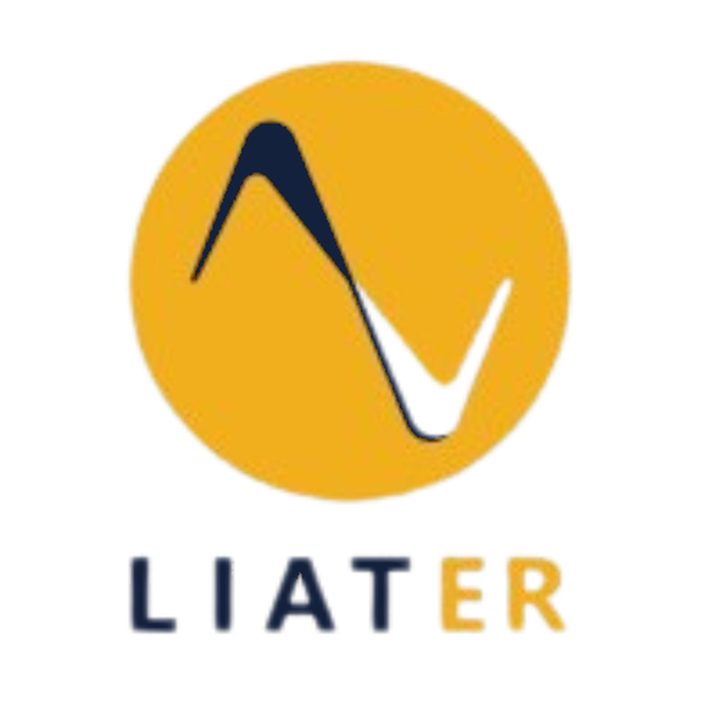
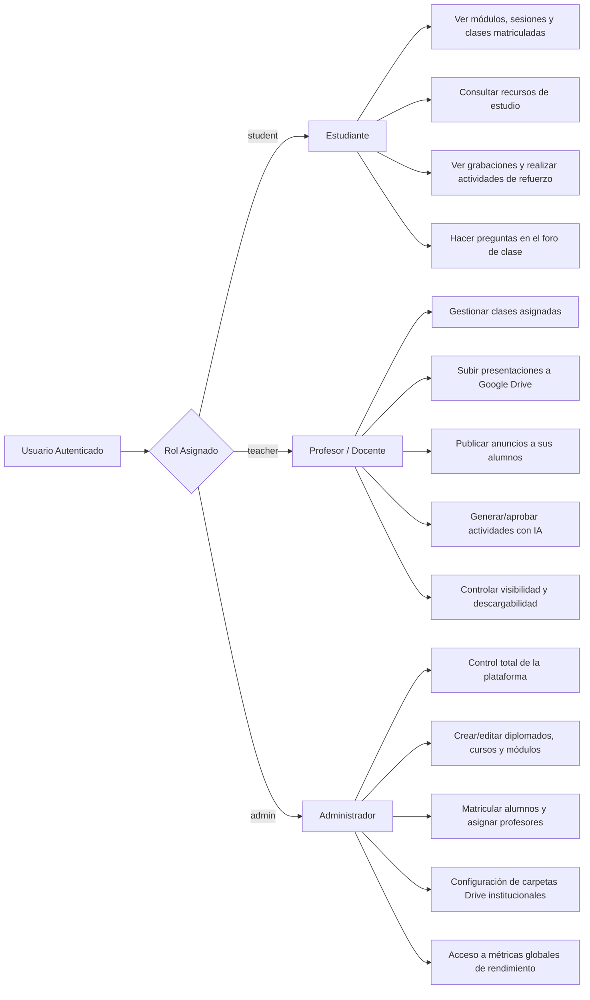

# 🎓 LIATER — Sistema de Gestión del Aprendizaje (LMS)
### Universidad Nacional de Colombia — Sede Bogotá & Corenius

<div align="center">
  
  <br />
  <p><strong>Plataforma Integral de Gestión y Entrega de Programas Académicos (Diplomados, Cursos y Talleres)</strong></p>
  
  <p>
    
    
    
    
    
    
  </p>
</div>

---

## 📌 Tabla de Contenidos
1. [Descripción General](#-descripción-general)
2. [Identidad Visual y Emblema 3D](#-identidad-visual-y-emblema-3d)
3. [Stack Tecnológico](#-stack-tecnológico)
4. [Arquitectura del Sistema](#-arquitectura-del-sistema)
5. [Roles y Matriz de Permisos](#-roles-y-matriz-de-permisos)
6. [Módulos Principales de la Plataforma](#-módulos-principales-de-la-plataforma)
7. [Integraciones Avanzadas](#-integraciones-avanzadas)
   - [Integración con Google Drive](#1-integración-con-google-drive-nomenclatura-y-cuota-cero)
   - [Automatización de Grabaciones con YouTube y Transcripciones](#2-automatización-de-grabaciones-con-youtube-y-transcripciones)
   - [Generación de Preguntas de Reforzamiento con IA](#3-generación-de-evaluaciones-y-reforzamiento-con-ia-gemini)
   - [Centro de Recursos y Materiales con Filtrado por Sesiones](#4-centro-de-recursos-y-materiales-con-filtrado-por-sesiones)
8. [Estructura del Proyecto](#-estructura-del-proyecto)
9. [Variables de Entorno](#-variables-de-entorno)
10. [Instalación y Puesta en Marcha](#-instalación-y-puesta-en-marcha)
11. [Flujo de Ramas y Despliegue](#-flujo-de-ramas-y-despliegue)
12. [Documentación Complementaria](#-documentación-complementaria)

---

## 📖 Descripción General

**LIATER** es una plataforma educativa de vanguardia desarrollada para la **Universidad Nacional de Colombia** en alianza con **Corenius**. Su propósito fundamental es centralizar, estructurar y potenciar la experiencia de aprendizaje en programas de educación continua, abarcando desde **diplomados de alta intensidad** hasta **cursos cortos especializados**.

La plataforma resuelve los desafíos habituales del aprendizaje virtual:
- **Navegación Contextual Inteligente:** Adaptación automática de la interfaz según el tipo de programa (`diplomado` con jerarquía de Módulos $\rightarrow$ Sesiones $\rightarrow$ Clases, o `curso` con acceso directo Sesiones $\rightarrow$ Clases).
- **Consumo Sin Costo de Egreso:** Integración con Google Drive y YouTube que permite servir gigabytes de presentaciones, lecturas y videos sin consumir ancho de banda en la base de datos.
- **Evaluación y Reforzamiento Automatizado con IA:** Extracción de transcripciones de clases y generación automática de cuestionarios formativos para afianzar el aprendizaje del estudiante.
- **Control de Propiedad Intelectual:** Opción para que profesores y administradores definan si los materiales de estudio son descargables o únicamente consultables en línea.

---

## 🎨 Identidad Visual y Emblema 3D

La plataforma implementa una estética de alta gama inspirada en los colores institucionales:
- **Azul Noche / Marino (`#14213D`):** Rigor académico y sobriedad.
- **Dorado / Ámbar (`#FCA311`):** Energía, excelencia y dinamismo.
- **Gris Claro / Slate (`#F8FAFC`, `#E2E8F0`):** Limpieza, contraste y legibilidad óptima.

<div align="center">
  
  <p><em>Emblema 3D de LIATER renderizado en tiempo real con Three.js en la página de inicio.</em></p>
</div>

En la pantalla de bienvenida (`Home.jsx` y `LiaterHeroAnimation.jsx`), la plataforma renderiza en tiempo real el modelo tridimensional oficial (`LIATER_logo_3D.glb`) sobre un canvas acelerado por WebGL con controles orbitales limitados, iluminación cinemática y sombras suaves.

---

## 🛠️ Stack Tecnológico

| Capa / Componente | Tecnología | Propósito |
| :--- | :--- | :--- |
| **Frontend Core** | React 19 + Vite 8 | Renderizado reactivo ultrarrápido y Hot Module Replacement |
| **Enrutamiento** | React Router DOM v6 | Navegación protegida y jerárquica con rutas contextuales |
| **3D & WebGL** | Three.js + React Three Fiber + Drei | Renderizado e interacción del emblema 3D `LIATER_logo_3D.glb` |
| **Iconografía** | Lucide React | Sistema de iconos vectoriales coherente y liviano |
| **Estilos** | CSS Puro (Variables CSS + Glassmorphism) | Cero dependencias utilitarias pesadas, alto rendimiento |
| **Backend & Base de Datos** | Supabase (PostgreSQL 15+) | Almacenamiento relacional, autenticación JWT y Row Level Security |
| **Edge Functions** | Deno Runtime (TypeScript) | Microservicios serverless para Drive, correos y generación IA |
| **Inteligencia Artificial** | Google Gemini API | Generación automatizada de preguntas de refuerzo formativo |
| **Almacenamiento Cloud** | Google Drive API v3 (OAuth 2.0) | Almacenamiento y servicio de presentaciones y PDFs |
| **Automatización Externa**| Google Apps Script | Sincronización periódica de grabaciones de YouTube y Drive |

---

## 🏛️ Arquitectura del Sistema

```mermaid
graph TD
    subgraph Frontend["Frontend (React 19 + Vite)"]
        UI_Home["Landing Page + Emblema 3D"]
        UI_Auth["Autenticación & Perfil"]
        UI_Portal["Portal de Programas"]
        UI_Dash["Dashboard del Estudiante"]
        UI_Class["Aula Virtual (Video + Actividades)"]
        UI_Resources["Centro de Recursos (Filtro Sesiones)"]
        UI_Admin["Panel de Administración"]
        UI_Teacher["Panel del Docente"]
    end

    subgraph Supabase["Backend Supabase Cloud"]
        AuthService["Supabase Auth (JWT)"]
        PostgresDB[("PostgreSQL Database + RLS")]
        
        subgraph Functions["Edge Functions (Deno)"]
            F_Drive["upload-pdf-drive"]
            F_Auto["automatizacion-drive"]
            F_AI["generar-preguntas-reforzamiento"]
            F_Mail["send-announcement / invite-user"]
        end
    end

    subgraph External["Servicios Externos"]
        GDrive["Google Drive API v3 (OAuth 2.0)"]
        YouTube["YouTube Data API v3"]
        Gemini["Google Gemini AI"]
        AppsScript["Google Apps Script (Cron Job)"]
    end

    %% Relaciones
    Frontend -->|Tokens JWT / Session| AuthService
    Frontend -->|Consultas SQL seguras| PostgresDB
    Frontend -->|Invocación directa| Functions

    F_Drive -->|Subida multipart & permisos| GDrive
    F_Auto -->|Transcribe & procesa| GDrive
    F_AI -->|Prompt pedagógico| Gemini
    AppsScript -->|Detecta videos| YouTube
    AppsScript -->|Notifica clases| F_Auto

    UI_Class -.->|Embebido iframe| GDrive
    UI_Resources -.->|Embebido iframe / Descarga| GDrive
```



---

## 👥 Roles y Matriz de Permisos

El sistema maneja tres roles diferenciados a nivel de interfaz y asegurados a nivel de base de datos mediante **Row Level Security (RLS)**:



| Funcionalidad / Permiso | Estudiante | Profesor | Administrador |
| :--- | :---: | :---: | :---: |
| Explorar catálogo y matricularse en programas | ✅ | ✅ | ✅ |
| Visualizar clases y reproducir grabaciones | ✅ (Inscrito) | ✅ (Asignado) | ✅ (Todos) |
| Ver presentaciones y lecturas en visor embebido | ✅ | ✅ | ✅ |
| Descargar material (si está habilitado como descargable) | ✅ | ✅ | ✅ |
| Subir material a Google Drive con nomenclatura estándar | ❌ | ✅ | ✅ |
| Conmutar descargabilidad de materiales (`is_downloadable`) | ❌ | ✅ | ✅ |
| Ocultar o publicar materiales (`is_visible`) | ❌ | ✅ | ✅ |
| Crear y publicar anuncios del curso | ❌ | ✅ | ✅ |
| Generar preguntas de reforzamiento con Gemini AI | ❌ | ✅ | ✅ |
| Responder evaluaciones de refuerzo y ver retroalimentación | ✅ | ❌ | ❌ |
| Crear cursos, módulos, sesiones y programar clases | ❌ | ❌ | ✅ |
| Gestión global de usuarios (invitaciones, roles) | ❌ | ❌ | ✅ |
| Configurar carpetas raíz de Google Drive del curso | ❌ | ❌ | ✅ |

---

## 🖥️ Módulos Principales de la Plataforma

### 1. Portal de Programas (`/portal`)
Vista principal tras iniciar sesión. Muestra la parrilla de diplomados y cursos a los que el usuario tiene acceso, su progreso y estado de publicación. Los administradores pueden crear nuevos programas académicos y configurar su modalidad (`diplomado` o `curso`).

### 2. Dashboard del Programa (`/dashboard/:programId`)
Página de inicio contextual del curso. Presenta estadísticas clave (módulos, sesiones, clases programadas, avisos recientes y enlace a la próxima sala virtual de Meet/Zoom).

### 3. Centro de Recursos y Materiales (`/resources/:programId`)
Espacio unificado donde convergen todos los documentos de estudio:
- **Contenido General del Curso:** Guías académicas, manuales y bibliografía transversal.
- **Materiales por Sesión:** Diapositivas y lecturas vinculadas a sesiones específicas.
- **Filtro Avanzado por Sesiones:** Selector dinámico que permite aislar el material de una sesión en particular con conteo en tiempo real.
- **Insignias Informativas de Sesión y Clase:** Cada tarjeta indica claramente a qué sesión y a qué clase pertenece (ej: `Sesión 1 · Clase 2`).
- **Visor Integrado:** Modal con visor `<iframe>` acelerado para leer documentos sin salir de la plataforma.

<div align="center">
  
  <p><em>Tarjetas de recursos con visualización contextual de sesión, clase, fecha y acciones de estudio.</em></p>
</div>

### 4. Aula Virtual de Clase (`/class/:classId`)
Espacio interactivo de aprendizaje:
- **Reproductor de Video:** Reproducción fluida de la grabación de la clase.
- **Visor de Diapositivas:** Visualización de la presentación oficial de la clase incrustada desde Google Drive.
- **Actividades de Reforzamiento:** Quices formativos interactivos con retroalimentación inmediata generados con Inteligencia Artificial.
- **Foro de Dudas:** Sistema de preguntas vinculadas al minuto exacto del video para resolver inquietudes con el docente.

### 5. Panel de Administración (`/dashboard/admin/:programId`)
Consola completa organizada en pestañas especializadas:
- **Resumen:** Métricas globales del curso.
- **Alumnos:** Matrícula y control de estudiantes inscritos.
- **Profesores:** Asignación de docentes y carga académica.
- **Estructura (Course Builder):** Creación y ordenamiento de módulos, sesiones y clases.
- **Recursos:** Control global de materiales de estudio y descargabilidad.
- **Anuncios:** Emisión de comunicados con envío masivo de correos.
- **Configuración:** Vinculación de la carpeta institucional de Google Drive y enlaces de videoconferencia.

### 6. Panel del Docente (`/dashboard/profesor/:programId`)
Consola dedicada para profesores asignados al programa:
- Control de sus clases asignadas (fechas, enlaces, grabaciones).
- Carga de presentaciones y PDFs mediante arrastrar y soltar (*Drag & Drop*) directo a Google Drive.
- Supervisión del avance de los estudiantes en las actividades de refuerzo.

---

## ⚡ Integraciones Avanzadas

### 1. Integración con Google Drive (Nomenclatura y Cuota Cero)
La plataforma no almacena archivos binarios pesados en la base de datos de Supabase. A través de la Edge Function `upload-pdf-drive` y OAuth 2.0 con Refresh Token de la cuenta institucional:
1. El docente arrastra el PDF en la interfaz.
2. La Edge Function obtiene un token de acceso fresco ante Google.
3. Se aplica la nomenclatura estándar: `[Clase XX - Titulo] Archivo.pdf`.
4. El archivo se deposita en la carpeta del curso en Google Drive y se le asigna permiso público de lectura.
5. Los estudiantes visualizan el documento en un visor incrustado sin que la universidad pague egreso de datos.

> 📘 Consulta la documentación técnica detallada en [INTEGRACION_GOOGLE_DRIVE.md](docs/INTEGRACION_GOOGLE_DRIVE.md).

### 2. Automatización de Grabaciones con YouTube y Transcripciones
Mediante un script en **Google Apps Script** (`apps-script/AutomatizacionLIATER.gs`) ejecutado periódicamente:
1. Se detectan las nuevas grabaciones transmitidas o subidas al canal de YouTube del programa.
2. Se sincronizan automáticamente con la tabla `class_sessions` en Supabase asignando `video_url`.
3. Se extrae la transcripción oficial o subtítulos del video y se almacena en la tabla `drive_transcript_jobs`.

### 3. Generación de Evaluaciones y Reforzamiento con IA (Gemini)
A partir de la transcripción de la clase:
1. La Edge Function `generar-preguntas-reforzamiento` envía un prompt pedagógico estructurado a la API de **Google Gemini**.
2. Gemini analiza el contenido impartido por el profesor y genera entre 3 y 5 preguntas de selección múltiple con opciones, justificación conceptual y respuesta correcta.
3. El profesor o administrador puede previsualizar, editar o publicar las preguntas.
4. El estudiante responde en la pestaña "Actividades" de su clase y recibe retroalimentación inmediata para reforzar su comprensión.

### 4. Centro de Recursos y Materiales con Filtrado por Sesiones
- **Doble ámbito:** Recursos generales aplicables a todo el programa vs. recursos asignados a clases específicas.
- **Filtro reactivo:** Selector que lista cada sesión con su número exacto de materiales.
- **Protección de Descargas:** Columna `is_downloadable` en la tabla `resources`. Si es `false`, la plataforma muestra el botón de visualización pero deshabilita u oculta los botones de descarga directa para proteger el material intelectual.

---

## 📁 Estructura del Proyecto

```plaintext
LIATER/
├── apps-script/                 # Automatización de grabaciones YouTube (Google Apps Script)
│   └── AutomatizacionLIATER.gs
├── docs/                        # Documentación técnica detallada
│   ├── assets/                  # Logotipos, capturas y diagramas de la documentación
│   ├── INTEGRACION_GOOGLE_DRIVE.md
│   ├── AUTOMATIZACION_YOUTUBE_IA.md
│   └── CENTRO_DE_RECURSOS.md
├── public/                      # Assets estáticos servidos directamente
│   ├── favicon.svg
│   └── models/                  # Modelos 3D GLTF/GLB
├── src/
│   ├── assets/                  # Identidad visual (SVG, PNG, JPG)
│   ├── components/              # Componentes de React reutilizables
│   │   ├── admin/               # Subvistas del panel de administración (CourseBuilder, etc.)
│   │   ├── common/              # Modales, botones, alertas y loaders compartidos
│   │   ├── Header.jsx           # Barra superior institucional
│   │   ├── Sidebar.jsx          # Barra lateral adaptativa por contexto de curso
│   │   ├── ProtectedRoute.jsx   # Guardia de seguridad de rutas por rol
│   │   └── LiaterHeroAnimation.jsx # Canvas Three.js con modelo 3D
│   ├── config/                  # Configuraciones globales
│   ├── context/                 # Context API (AuthContext.jsx)
│   ├── lib/                     # Clientes de servicios (supabaseClient.js)
│   ├── pages/                   # Vistas principales de la aplicación
│   │   ├── Home.jsx             # Portada pública con animación 3D
│   │   ├── Login.jsx            # Autenticación segura
│   │   ├── Portal.jsx           # Cuadrícula de diplomados y cursos
│   │   ├── Dashboard.jsx        # Resumen del curso para estudiantes
│   │   ├── ClassDetail.jsx      # Aula virtual (video, visor Drive, quices)
│   │   ├── CourseResources.jsx  # Centro de recursos con filtro por sesión
│   │   ├── AdminPanel.jsx       # Panel de gestión administrativa
│   │   ├── TeacherPanel.jsx     # Panel de gestión docente
│   │   └── UserManagement.jsx   # Administración global de usuarios
│   ├── services/                # Servicios de negocio (activityService, programService, etc.)
│   └── utils/                   # Utilidades de fecha, validación y almacenamiento
├── supabase/
│   ├── functions/               # Edge Functions en Deno
│   │   ├── upload-pdf-drive/
│   │   ├── automatizacion-drive/
│   │   ├── generar-preguntas-reforzamiento/
│   │   └── invite-user/
│   └── migrations/              # 10 migraciones SQL versionadas
├── AI_CONTEXT.md                # Bitácora y directivas estrictas para asistentes de IA
├── DATA_MODEL.md                # Esquema de base de datos PostgreSQL detallado
├── PROJECT_SCOPE.md             # Alcance funcional y requerimientos del proyecto
└── README.md                    # Esta documentación principal
```

---

## 🔐 Variables de Entorno

Crea un archivo `.env` en la raíz del proyecto basándote en el siguiente formato:

```env
# Conexión a Supabase Cloud
VITE_SUPABASE_URL=https://tu-proyecto.supabase.co
VITE_SUPABASE_ANON_KEY=tu-anon-key-publica-jwt
```

Para las **Edge Functions en Supabase**, los siguientes secrets deben estar configurados en el Dashboard de Supabase (`Project Settings` $\rightarrow$ `Edge Functions` $\rightarrow$ `Secrets`):

| Variable / Secret | Descripción |
| :--- | :--- |
| `SUPABASE_SERVICE_ROLE_KEY` | Llave maestra de Supabase para operaciones administrativas seguras |
| `GOOGLE_CLIENT_ID` | Identificador de cliente OAuth 2.0 de Google Cloud Platform |
| `GOOGLE_CLIENT_SECRET` | Secreto de cliente OAuth 2.0 de Google Cloud Platform |
| `GOOGLE_REFRESH_TOKEN` | Token de actualización permanente de la cuenta institucional de Drive |
| `GEMINI_API_KEY` | Llave de API de Google Gemini para la generación de evaluaciones con IA |

---

## 🚀 Instalación y Puesta en Marcha

### Prerrequisitos
- **Node.js**: Versión 18.x o superior (recomendado Node 20 LTS).
- **npm**: Versión 9.x o superior.
- Navegador moderno con soporte para WebGL (para el visualizador 3D).

### Pasos
1. **Clonar el repositorio:**
   ```bash
   git clone https://github.com/JuanBeltran2024/LIATER.git
   cd LIATER
   ```

2. **Instalar dependencias:**
   ```bash
   npm install
   ```

3. **Configurar el entorno:**
   Copia el archivo `.env.example` a `.env` y completa las credenciales de Supabase:
   ```bash
   cp .env.example .env
   ```

4. **Iniciar el servidor de desarrollo:**
   ```bash
   npm run dev
   ```
   Abre tu navegador en `http://localhost:5173`.

5. **Construir para producción:**
   ```bash
   npm run build
   ```
   Los archivos optimizados para producción se generarán en la carpeta `dist/`.

---

## 🌿 Flujo de Ramas y Despliegue

El proyecto opera bajo un flujo estricto de dos niveles:

1. **Entorno de Desarrollo (`juanbeltran`):**
   - **Repositorio:** `https://github.com/JuanBeltran2024/LIATER.git`
   - **Rama:** `main`
   - **Regla:** Todos los desarrollos activos, nuevas funcionalidades y pruebas se envían a este repositorio ejecutando siempre un `git pull juanbeltran main` antes de cada push.

2. **Entorno de Producción (`origin` / Corenius):**
   - **Repositorio:** `https://github.com/Corenius2026/LIATER.git`
   - **Rama:** `main`
   - **Regla:** Únicamente se realiza push a este repositorio cuando una versión estable o actualización a la plataforma pública esté lista y explícitamente autorizada.

---

## 📚 Documentación Complementaria

Para profundizar en áreas específicas del sistema, consulta los siguientes documentos:
- [DATA_MODEL.md](DATA_MODEL.md): Esquema físico de PostgreSQL, tipos de datos, constraints y políticas RLS.
- [PROJECT_SCOPE.md](PROJECT_SCOPE.md): Alcance del proyecto, perfiles de usuario e historias operativas.
- [AI_CONTEXT.md](AI_CONTEXT.md): Guía de arquitectura, directivas de desarrollo y directrices de código para agentes de IA.
- [INTEGRACION_GOOGLE_DRIVE.md](docs/INTEGRACION_GOOGLE_DRIVE.md): Arquitectura, flujo OAuth y solución de problemas con la API de Google Drive.
- [AUTOMATIZACION_YOUTUBE_IA.md](docs/AUTOMATIZACION_YOUTUBE_IA.md): Pipeline de sincronización de clases y generación de cuestionarios con IA.
- [CENTRO_DE_RECURSOS.md](docs/CENTRO_DE_RECURSOS.md): Guía funcional y técnica del centro de materiales de estudio y descargabilidad.

---

<div align="center">
  <p><strong>LIATER — Plataforma de Educación Continua</strong></p>
  <p>Universidad Nacional de Colombia • Sede Bogotá &nbsp;|&nbsp; Corenius &copy; 2026</p>
</div>
