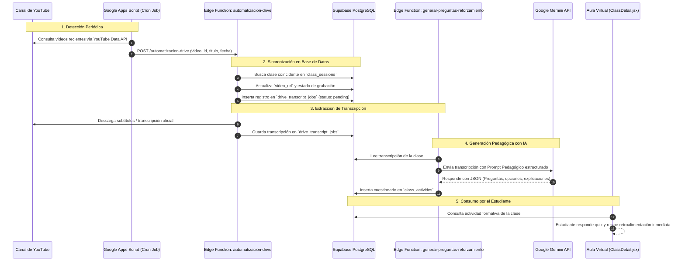

# 🤖 Documentación Técnica: Automatización de Grabaciones (YouTube) y Generación de Evaluaciones con IA (Gemini)
### Portal Educativo LIATER — Universidad Nacional de Colombia & Corenius

---

## 1. 🎯 Objetivo del Sistema

Automatizar el ciclo de vida posterior a cada clase virtual:
1. **Detectar y sincronizar** las grabaciones transmitidas o subidas al canal de YouTube del programa.
2. **Asociar automáticamente** el video a la clase correspondiente en la base de datos de LIATER (`class_sessions.video_url`).
3. **Extraer la transcripción textual** de la sesión académica impartida por el docente.
4. **Generar cuestionarios de reforzamiento formativo** mediante **Google Gemini AI** con preguntas contextualizadas, opciones múltiples y justificaciones pedagógicas paso a paso.

---

## 2. 🏛️ Diagrama de Flujo del Pipeline

---

## 3. 🧩 Componentes del Sistema

### 3.1 Google Apps Script (`apps-script/AutomatizacionLIATER.gs`)
- **Ubicación:** `apps-script/AutomatizacionLIATER.gs`
- **Función:** Script de Google Apps Script configurado con un disparador por tiempo (*time-driven trigger*) para ejecutarse periódicamente (cada 30 a 60 minutos).
- **Flujo:**
  1. Utiliza el servicio avanzado `YouTube.PlaylistItems.list` o `YouTube.Search.list` con la cuenta del canal oficial.
  2. Identifica transmisiones finalizadas o videos publicados recientemente.
  3. Realiza una petición `UrlFetchApp.fetch` hacia la Edge Function de Supabase `automatizacion-drive` enviando el payload con la información del video.

### 3.2 Edge Function `automatizacion-drive`
- **Ubicación:** `supabase/functions/automatizacion-drive/index.ts`
- **Entorno:** Deno Runtime en Supabase Cloud.
- **Acciones:**
  - Recibe el webhook o llamada autorizada con el ID del video de YouTube.
  - Asocia el video a la clase en `class_sessions` basándose en coincidencia de fecha programada o título.
  - Dispara la tarea de extracción de subtítulos/transcripción.
  - Registra el trabajo en la tabla `drive_transcript_jobs`.

### 3.3 Edge Function `generar-preguntas-reforzamiento`
- **Ubicación:** `supabase/functions/generar-preguntas-reforzamiento/index.ts`
- **Entorno:** Deno Runtime en Supabase Cloud.
- **Integración con IA:** Utiliza el modelo `gemini-1.5-flash` o `gemini-1.5-pro` mediante la API oficial de Google AI Studio / Vertex AI.
- **Estructura del Prompt Pedagógico:**
  - Rol asignado al modelo: *Experto pedagogo universitario en ingeniería y tecnologías de la información*.
  - Parámetros: Entre 3 y 5 preguntas de selección múltiple (A, B, C, D).
  - Cada pregunta incluye:
    - Enunciado claro contextualizado a lo explicado por el profesor.
    - 4 opciones de respuesta donde sólo 1 es correcta.
    - Explicación conceptual detallada del porqué de la respuesta correcta.
  - Formato de salida: JSON estrictamente estructurado sin markdown residual.

### 3.4 Interfaz de Estudiante (`src/pages/ClassDetail.jsx`)
- En la pestaña **"Actividades"** del visor de clase:
  - El alumno visualiza el cuestionario interactivo.
  - Al completar el intento, la plataforma evalúa las respuestas contra la tabla `class_activities`, calcula el puntaje sobre 5.0, registra el intento en `activity_submissions` y muestra al estudiante la retroalimentación inmediata con justificación pedagógica de cada opción.

---

## 4. 🔐 Configuración de Secrets

En el panel de Supabase (`Project Settings` $\rightarrow$ `Edge Functions` $\rightarrow$ `Secrets`):

| Secret | Descripción |
| :--- | :--- |
| `GEMINI_API_KEY` | Llave de API para invocar el modelo Gemini |
| `SUPABASE_SERVICE_ROLE_KEY` | Llave de servicio para escribir en `class_activities` y `drive_transcript_jobs` |
| `SUPABASE_URL` | URL de la instancia de Supabase |
