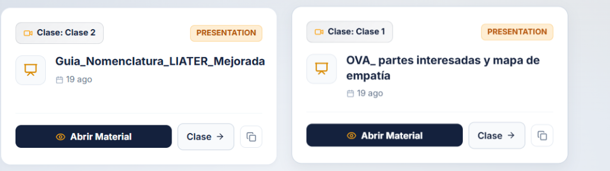
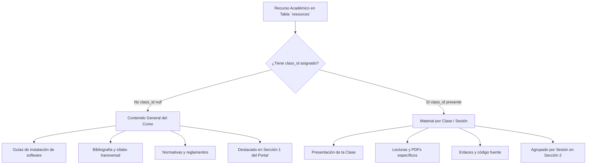
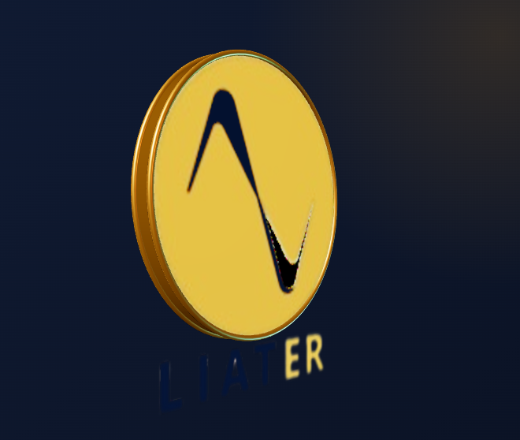

# 📚 Documentación Técnica y Funcional: Centro de Recursos y Materiales de Estudio
### Portal Educativo LIATER — Universidad Nacional de Colombia & Corenius

---

## 1. 🎯 Propósito del Módulo

El **Centro de Recursos** (`src/pages/CourseResources.jsx`) es el repositorio académico unificado de cada diplomado o curso. Provee un punto de acceso centralizado donde convergen tanto las guías metodológicas transversales como las presentaciones, lecturas, PDFs, repositorios y grabaciones asociadas a cada sesión y clase del programa.

<div align="center">
  
  <p><em>Vista de tarjetas de recursos con badges dinámicos de Sesión y Clase, tipo de material y acciones.</em></p>
</div>

---

## 2. 🏛️ Arquitectura de Ámbitos (General vs. Por Clase)

El módulo divide arquitectónicamente los recursos en dos grandes categorías:



### 2.1 Contenido General del Curso
- **Almacenamiento:** Registro en `resources` con `program_id = cleanProgramId` y `class_id = null`.
- **Propósito:** Material transversal aplicable a la totalidad del programa académico.
- **Presentación:** Sección superior destacada con borde dorado institucional y badge *"Contenido General del Curso"*.

### 2.2 Materiales por Sesión / Clase
- **Almacenamiento:** Registro en `resources` con `class_id` vinculado a una clase en `class_sessions`.
- **Propósito:** Diapositivas, lecturas y guías de una clase específica.
- **Resolución Relacional:** La clase se asocia automáticamente a su sesión padre (`subtopics` / `sessions`), permitiendo consultar el título de la sesión y el título de la clase.

---

## 3. 🔍 Sistema de Filtrado Inteligente

La barra de herramientas superior ofrece un sistema de filtrado multidimensional:

<div align="center">
  
  <p><em>Barra de filtros con selector de sesión, búsqueda en tiempo real y selector de tipo de material.</em></p>
</div>

1. **Buscador en tiempo real:** Filtra simultáneamente por título del recurso, descripción, nombre de la clase, nombre de la sesión y nombre del módulo.
2. **Selector de Ámbito / Sesión:**
   - `Todo el Material`: Lista todos los recursos del curso (generales y de clases).
   - `Contenido General del Curso`: Aísla exclusivamente el material transversal.
   - `Filtrar por Sesión`: Muestra cada sesión del curso con el conteo exacto de materiales en tiempo real (ej: *Sesión 1: Fundamentos (3 materiales)*).
3. **Pills de Tipo de Material:** Filtra por `Presentaciones`, `Lecturas / PDF`, `Enlaces` o `Código / Repositorios` con contadores reactivos.

---

## 4. 🏷️ Insignia Dinámica: Sesión y Clase

Cada tarjeta de material incluye una insignia superior que identifica con precisión el contexto pedagógico del recurso:

```jsx
// Helper de formateo implementado en CourseResources.jsx
function formatSessionAndClass(sessionTitle, classTitle) {
  const cTitle = classTitle ? classTitle.trim() : '';
  const sTitle = sessionTitle ? sessionTitle.trim() : '';

  if (!sTitle) {
    if (!cTitle) return 'Clase';
    return cTitle.toLowerCase().startsWith('clase') ? cTitle : `Clase: ${cTitle}`;
  }

  const sessionPart = sTitle.toLowerCase().startsWith('sesi') ? sTitle : `Sesión: ${sTitle}`;
  const classPart = cTitle.toLowerCase().startsWith('clase') ? cTitle : `Clase: ${cTitle}`;

  return `${sessionPart} · ${classPart}`;
}
```

- **Ejemplo 1:** Sesión: *"Sesión 1"*, Clase: *"Clase 2"* $\rightarrow$ **`Sesión 1 · Clase 2`**
- **Ejemplo 2:** Sesión: *"Fundamentos de IA"*, Clase: *"Clase 1"* $\rightarrow$ **`Sesión: Fundamentos de IA · Clase 1`**
- **Interacción:** Al hacer clic sobre la insignia, el usuario es redirigido directamente al aula virtual interactiva de esa clase (`/class/:classId`).

---

## 5. 🔒 Control de Descargabilidad (`is_downloadable`)

Para proteger los derechos de autor y la propiedad intelectual de los docentes y de la universidad:
1. La tabla `resources` incorpora la columna booleana `is_downloadable` (`DEFAULT true`).
2. **Para Profesores y Administradores:** Al subir o editar un recurso, disponen de un selector para conmutar si el archivo es descargable o de sólo lectura.
3. **Para Estudiantes:** 
   - Si `is_downloadable === true`: La tarjeta y el visor presentan los botones de descarga directa.
   - Si `is_downloadable === false`: Los botones de descarga directa se deshabilitan u ocultan, y el documento sólo puede consultarse en el visor incrustado.

---

## 6. 📤 Modal de Subida y Gestión (Profesores y Administradores)

Los usuarios con rol `teacher` o `admin` disponen de controles completos de gestión:
- **Subida de Archivo a Google Drive:** Con arrastrar y soltar (*Drag & Drop*), tamaño detectado en vivo y nomenclatura estandarizada.
- **Enlace Externo:** Opción para vincular presentaciones de Canva, repositorios de GitHub o sitios web.
- **Destino del Material:** Selector que permite destinar el archivo a *"Contenido General del Curso"* o a una *"Clase Específica"* con el formato `Sesión · Clase`.
- **Conmutador de Visibilidad:** Botón de un solo clic para ocultar o publicar el material ante los alumnos sin eliminarlo.
- **Eliminación Sincronizada:** Al eliminar un archivo subido a Google Drive, la plataforma invoca la API de Drive para remover el binario de la nube y borra el registro en la base de datos de LIATER.
